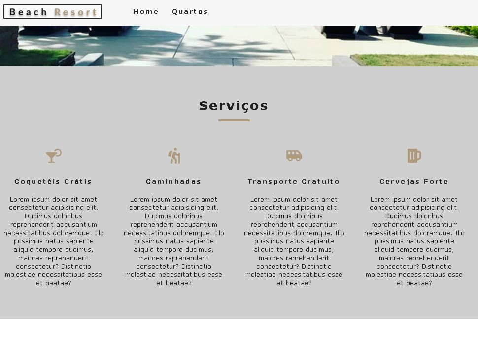
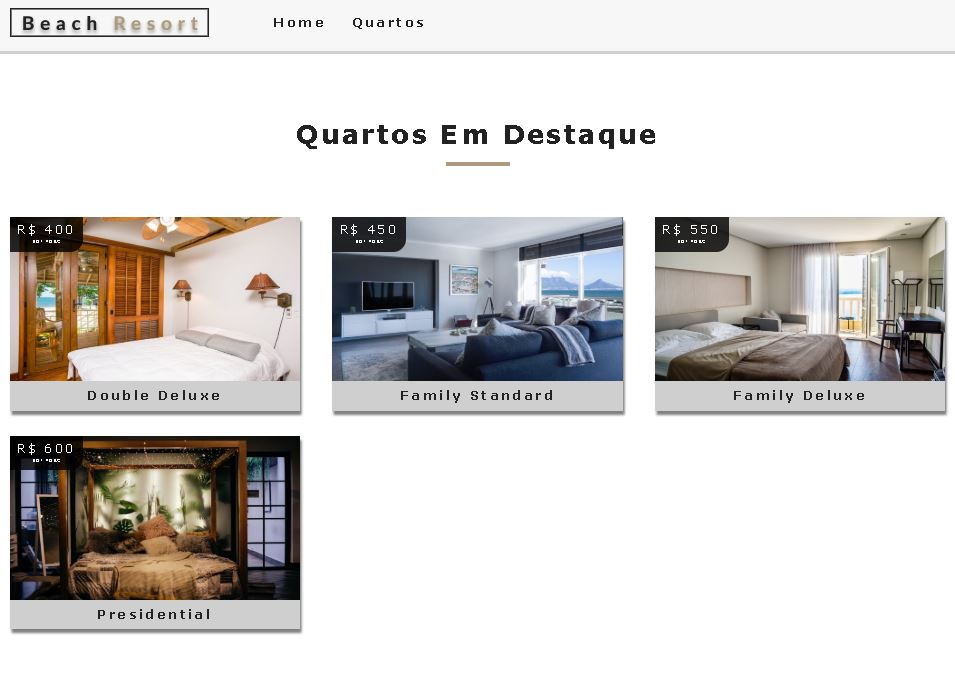
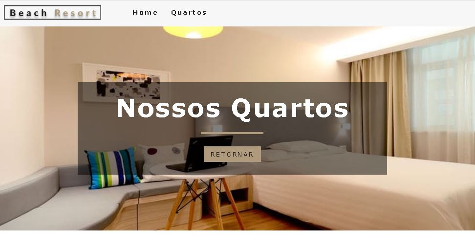
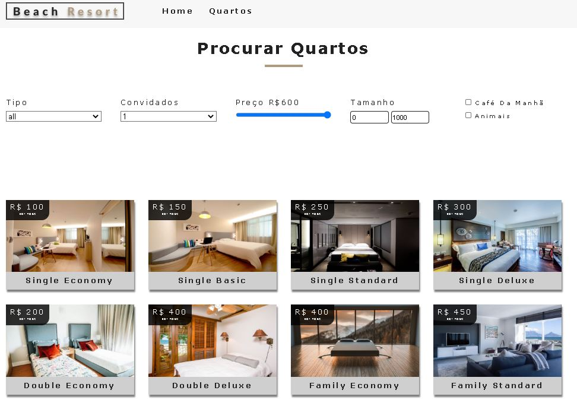
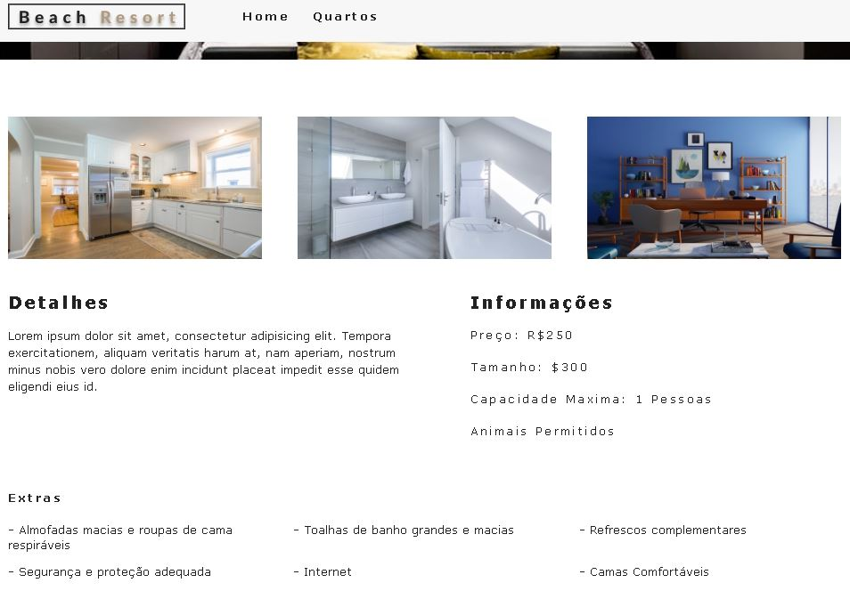

# Resort Reservation
 
  ## About
   Esse projeto foi desenvolvido para treinar a criação de componentes no React e a utilização do banco de dados da Contentful. Nesse app foi utilizado a Context API para passar informação entre as paginas ao invés do redux, visto que ela atende essas necessidades. 
  
  ## Libraries
   react;
   react-router-dom: Gerenciar rotas;
   dotenv: Criar variaveis ambiente;
   react-icons: Pegar icones para estilização do nosso app;
   contentful: Criar conexao com o servidor Contentful onde vai ficar nosso banco de dados;
   styled-components: Criar estilos dinamicos;
  
  ## Photos
  
  ### Home 
   
  
  ### Home - Services
   
   
  ### Home - Featureds
   
   
  ### Rooms
   
   
  ### Rooms - Filter
   
   
  ### Single Room
   
